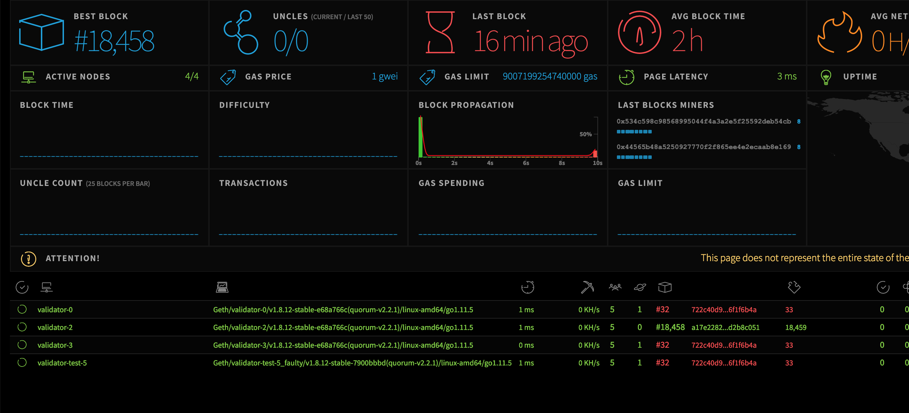

Ledgerium Blockchain Network Stats
============

This is a visual interface for Ledgerium Blockchain Network real time status.



## Prerequisite
* node
* npm

## Installation
Make sure you have node.js and npm installed.

Clone the repository and install the dependencies

```bash
git clone https://github.com/ledgerium/ledgeriumstats.git
cd ledgeriumstats
npm install
sudo npm install -g grunt-cli
```

## Build the resources
NetStats features two versions: the full version and the lite version. In order to build the static files you have to run grunt tasks which will generate dist or dist-lite directories containing the js and css files, fonts and images.


To build the full version run
```bash
grunt
```

To build the lite version run
```bash
grunt lite
```

If you want to build both versions run
```bash
grunt all
```

## Run

```bash
npm start
```
## Docker Image

The built image is available at 
```
https://hub.docker.com/r/ledgeriumengineering/ledgeriumstats
```

see the interface at http://testnet.ledgerium.net:3000